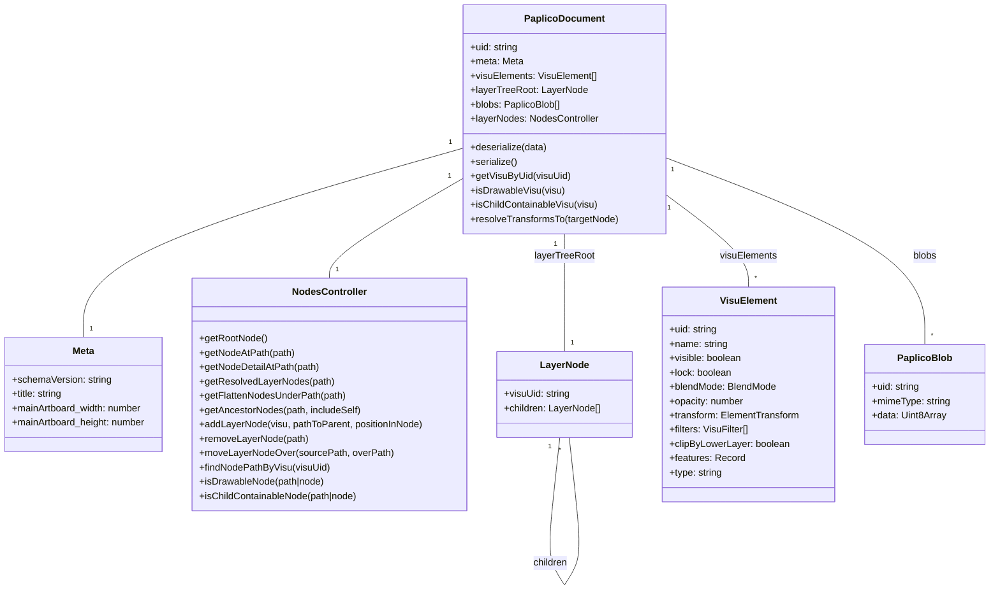
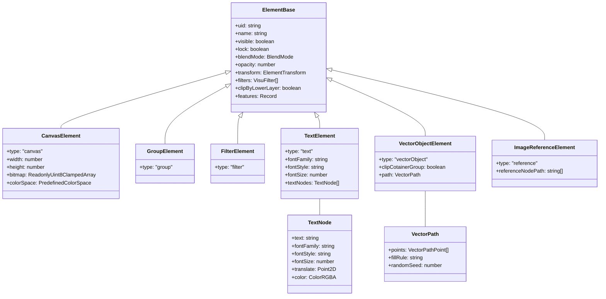
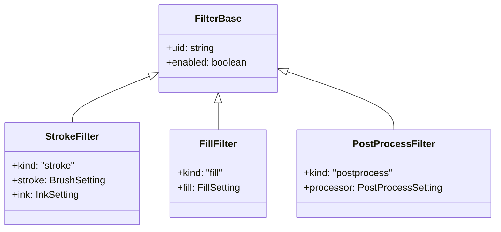
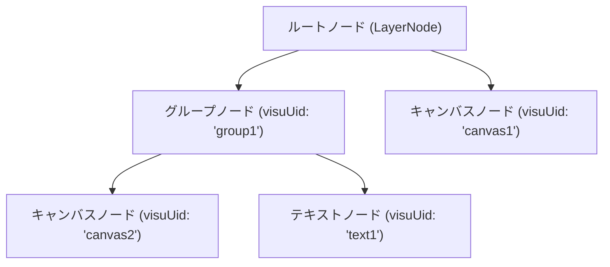
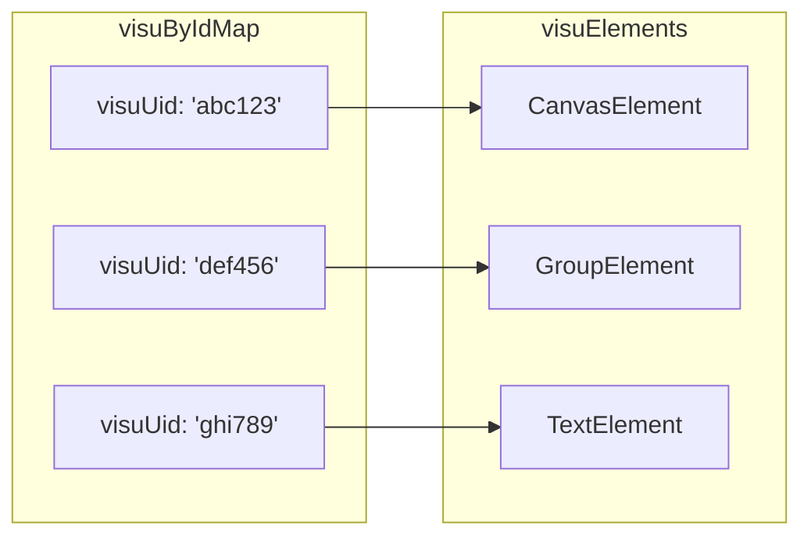

# Paplicoドキュメント仕様

このドキュメントは、Paplicoペイントアプリケーションのドキュメント構造に関する外部仕様と内部実装の詳細をまとめたものです。

## 目次

- [概要](#概要)
- [ドキュメント構造](#ドキュメント構造)
- [VisuElement（視覚要素）](#visuelement視覚要素)
- [VisuFilter（フィルター要素）](#visufilterフィルター要素)
- [レイヤーノード構造](#レイヤーノード構造)
- [シリアライズとデシリアライズ](#シリアライズとデシリアライズ)
- [内部実装の詳細](#内部実装の詳細)
- [ファクトリー関数](#ファクトリー関数)
- [構造体（Structs）](#構造体structs)
- [設定（Settings）](#設定settings)

## 概要

Paplicoドキュメントは、デジタルペイントやイラスト作成に必要なレイヤー、ビットマップデータ、ベクターデータなどを管理するための構造を提供します。中心となるクラスは `PaplicoDocument` で、これによりドキュメントの読み込み、保存、操作などが可能になります。

## ドキュメント構造



### PaplicoDocument

`PaplicoDocument`はPaplico内のドキュメントを表す中心的なクラスです。主な属性と機能は次のとおりです：

- **uid**: ドキュメントの一意識別子
- **meta**: ドキュメントのメタデータ（スキーマバージョン、タイトル、アートボードサイズ）
- **visuElements**: ドキュメントに含まれるすべての視覚要素のコレクション
- **layerTreeRoot**: レイヤーツリーのルートノード
- **blobs**: ドキュメントに関連付けられたバイナリデータのコレクション
- **layerNodes**: レイヤーノードを操作するためのコントローラー

### PaplicoBlob

`PaplicoBlob`はドキュメント内のバイナリデータを表します：

- **uid**: 一意識別子
- **mimeType**: データのMIMEタイプ
- **data**: バイナリデータ（Uint8Array）

## VisuElement（視覚要素）

VisuElement（視覚要素）は、Paplicoドキュメント内の描画可能なすべての要素の基本となるインターフェースです。いくつかの種類があり、それぞれ異なる表示と挙動を持ちます。



### ElementBase（基本要素）

すべての視覚要素に共通する基本プロパティを定義します：

- **uid**: 要素の一意識別子
- **name**: 要素の表示名
- **visible**: 要素の表示状態（表示/非表示）
- **lock**: ロック状態
- **blendMode**: ブレンドモード（"normal", "multiply"など）
- **opacity**: 不透明度（0～1の値）
- **transform**: 変形情報（位置、スケール、回転）
- **filters**: 適用されるフィルターのリスト
- **clipByLowerLayer**: 下のレイヤーでクリッピングするかどうか
- **features**: 拡張機能用の任意のデータを格納するオブジェクト

### VisuElementの種類

1. **CanvasElement**: ビットマップデータを持つキャンバス要素
   - **width/height**: キャンバスのサイズ
   - **bitmap**: ピクセルデータ（RGBA形式）
   - **colorSpace**: 色空間

2. **GroupElement**: 子要素をグループ化する要素
   - 子要素はレイヤーノードの階層で管理される

3. **FilterElement**: フィルター効果を提供する要素

4. **TextElement**: テキスト表示用の要素
   - **fontFamily**: フォントファミリー
   - **fontStyle**: フォントスタイル
   - **fontSize**: フォントサイズ
   - **textNodes**: テキストノードのリスト

5. **VectorObjectElement**: ベクターパスを表示する要素
   - **clipCotainerGroup**: クリッピングコンテナとして機能するかどうか
   - **path**: ベクターパスデータ

6. **ImageReferenceElement**: 他のノードを参照する要素
   - **referenceNodePath**: 参照先のノードパス

### VectorPath（ベクターパス）

ベクターオブジェクトのパスデータを表します：

- **points**: パスのポイントデータのリスト
- **fillRule**: 塗りつぶしルール（"nonzero"または"evenodd"）
- **randomSeed**: ランダムシードの値

### VectorPathPoint（ベクターパスポイント）

ベクターパスの頂点データを表します：

- **x/y**: 座標位置
- **begin**: ベジェ曲線の始点コントロールポイント
- **end**: ベジェ曲線の終点コントロールポイント
- **pressure**: 筆圧（0～1）
- **deltaTime**: 前のポイントからの時間差
- **tilt**: 傾き
- **isMoveTo**: 移動操作
- **isClose**: パスの閉じる操作

## VisuFilter（フィルター要素）

VisuFilterは、視覚要素に適用されるフィルター効果を定義します。



### フィルターの種類

1. **StrokeFilter**: ストローク効果を適用するフィルター
   - **stroke**: ブラシの設定
   - **ink**: インクの設定

2. **FillFilter**: 塗りつぶし効果を適用するフィルター
   - **fill**: 塗りつぶしの設定

3. **PostProcessFilter**: 後処理効果を適用するフィルター
   - **processor**: 後処理の設定

## レイヤーノード構造

Paplicoドキュメントのレイヤー構造は `LayerNode` オブジェクトのツリーとして実装されています。各ノードは視覚要素（VisuElement）への参照を持ち、階層構造を形成します。



### LayerNode（レイヤーノード）

レイヤーノードは簡潔な構造で、視覚要素への参照と子ノードのリストを持ちます：

- **visuUid**: 関連付けられた視覚要素のUID
- **children**: 子レイヤーノードのリスト

### NodesController（ノードコントローラー）

レイヤーノードの操作は `NodesController` を通じて行われます。このコントローラーは以下の機能を提供します：

- **getRootNode()**: ルートノードの取得
- **getNodeAtPath(path)**: 指定パスのノードを取得
- **getNodeDetailAtPath(path)**: 指定パスのノードの詳細情報を取得
- **getResolvedLayerNodes(path)**: 階層化されたノード構造を取得
- **getFlattenNodesUnderPath(path)**: 指定パス以下のノードをフラットに取得
- **getAncestorNodes(path, includeSelf)**: 祖先ノードのリストを取得
- **addLayerNode(visu, pathToParent, positionInNode)**: 新しいノードを追加
- **removeLayerNode(path)**: ノードを削除
- **moveLayerNodeOver(sourcePath, overPath)**: ノードを移動
- **findNodePathByVisu(visuUid)**: 指定UIDのノードのパスを検索
- **isDrawableNode(path|node)**: 描画可能かどうかを判定
- **isChildContainableNode(path|node)**: 子ノードを含められるかどうかを判定

## シリアライズとデシリアライズ

PaplicoDocumentは、以下の形式でシリアライズ可能です：

```typescript
interface SerializedSchema {
  uid: string;
  meta: Meta;
  visues: VisuElement.AnyElement[];
  layerTree: LayerNode;
  blobs: PaplicoBlob[];
}
```

このシリアライズされたデータから、`PaplicoDocument.deserialize()` メソッドを使用してドキュメントを再構築できます。

## 内部実装の詳細

### VisuElementの参照管理

VisuElementは一意のUID（`uid`プロパティ）で識別され、それを使って高速なルックアップが可能です。内部的には `visuByIdMap` というマップオブジェクトでキャッシュされています。



### トランスフォームの解決

レイヤーノードの階層では、親ノードのトランスフォーム（位置、スケール、回転）が子ノードに適用されます。`resolveTransformsTo`メソッドを使用して、特定のターゲットノードに至るまでのすべての親ノードのトランスフォームを計算することができます。

### レンダリング順序

レイヤーノード内の子レイヤーの順序は、レンダリング時の重ね順を決定します。ノードの配列内のインデックスが大きいほど、レンダリング時に前面に表示されます。

### パスベースのアドレシング

Paplicoドキュメント内のレイヤーノードは、UIDのパス（配列）によってアドレス指定されます。例えば、`['__root__', 'group1', 'canvas2']` というパスは、ルートノード下の 'group1' という名前のグループ内にある 'canvas2' というキャンバスノードを指します。

## ファクトリー関数

Visually/factory.ts モジュールは、様々なタイプの視覚要素を簡単に作成するためのファクトリー関数を提供します：

- **createDocument({width, height})**: 新しいPaplicoDocumentを作成
- **createLayerNode(visually)**: 新しいLayerNodeを作成
- **createFilterVisually(params)**: フィルター要素を作成
- **createGroupVisually(params)**: グループ要素を作成
- **createCanvasVisually({width, height, ...})**: キャンバス要素を作成
- **createCanvasVisuallyFromImage(imageOrUrl, ...)**: 画像からキャンバス要素を作成
- **createImageReferenceVisually(params)**: 画像参照要素を作成
- **createTextVisually(params)**: テキスト要素を作成
- **createVectorObjectVisually(params)**: ベクターオブジェクト要素を作成
- **createVectorPath(params)**: ベクターパスを作成
- **createVisuallyFilter(kind, params)**: 視覚フィルターを作成

これらのファクトリー関数は、新しい要素の作成時に適切なデフォルト値を設定し、ユニークなIDを生成します。

## 構造体（Structs）

Paplicoでは、様々なシンプルな型や構造体が定義されています：

### ColorRGB

RGBカラーを表す構造体：
- **r**: 赤成分（0～1）
- **g**: 緑成分（0～1）
- **b**: 青成分（0～1）

### ColorRGBA

アルファチャンネル付きRGBカラーを表す構造体：
- **r/g/b**: RGB成分（0～1）
- **a**: アルファ値（0～1）

### ColorStop1D

グラデーション用の色停止点を表す構造体：
- **position**: 位置（0～1）
- **color**: 色情報（ColorRGBA）

### Point2D

2次元座標を表す構造体：
- **x**: X座標
- **y**: Y座標

### ReadonlyUint8ClampedArray

読み取り専用のUint8ClampedArrayを表す型（ビットマップデータ用）

## 設定（Settings）

様々なレンダリング関連の設定を定義する構造体です：

### BrushSetting

ブラシの設定を表す構造体：
- **brushId**: ブラシの識別子
- **brushVersion**: ブラシのバージョン
- **size**: ブラシのサイズ（px単位）
- **color**: ブラシの色（ColorRGB）
- **opacity**: 不透明度（0～1）
- **settings**: ブラシ固有の設定

### FillSetting

塗りつぶし設定を表す型（単色塗りまたは線形グラデーション）：
- **単色**: 色とその不透明度
- **線形グラデーション**: カラーストップ、不透明度、開始・終了位置

### InkSetting

インク設定を表す構造体：
- **inkId**: インクの識別子
- **inkVersion**: インクのバージョン
- **settings**: インク固有の設定

### PostProcessSetting

後処理フィルターの設定を表す構造体：
- **filterId**: フィルターの識別子
- **filterVersion**: フィルターのバージョン
- **opacity**: 不透明度（0～1）
- **settings**: フィルター固有の設定

## まとめ

Paplicoドキュメントは柔軟で拡張可能な構造を持ち、多様な描画要素を階層的に管理できるように設計されています。ビットマップとベクターの両方のデータを統合的に扱うことができ、フィルターやトランスフォームなどの効果も適用できます。この設計により、モダンなデジタルペイント環境の基盤が提供されています。

特徴的な点としては：
1. レイヤー管理のための階層的なノード構造
2. ビットマップとベクターデータの統一管理
3. フィルター効果の柔軟な適用
4. UIから独立したコアモデル設計
5. 拡張可能なインターフェース設計
